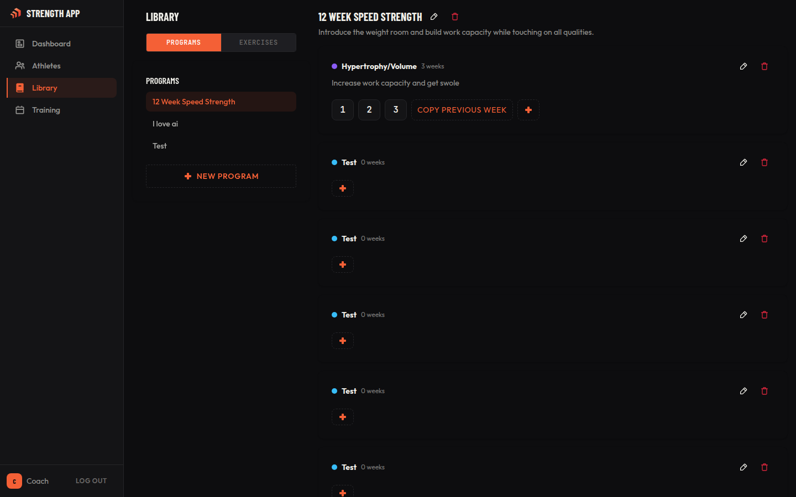
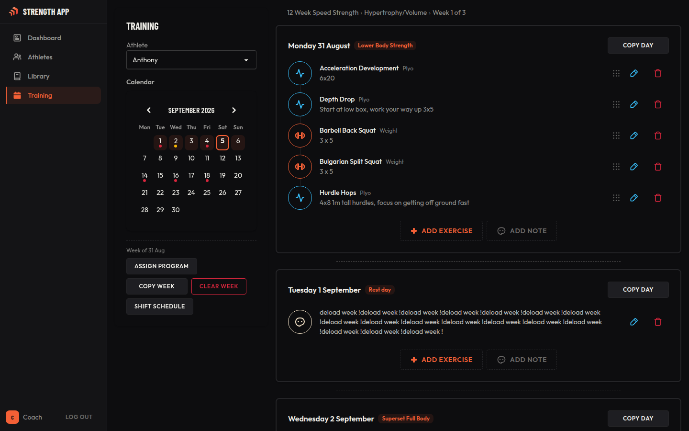
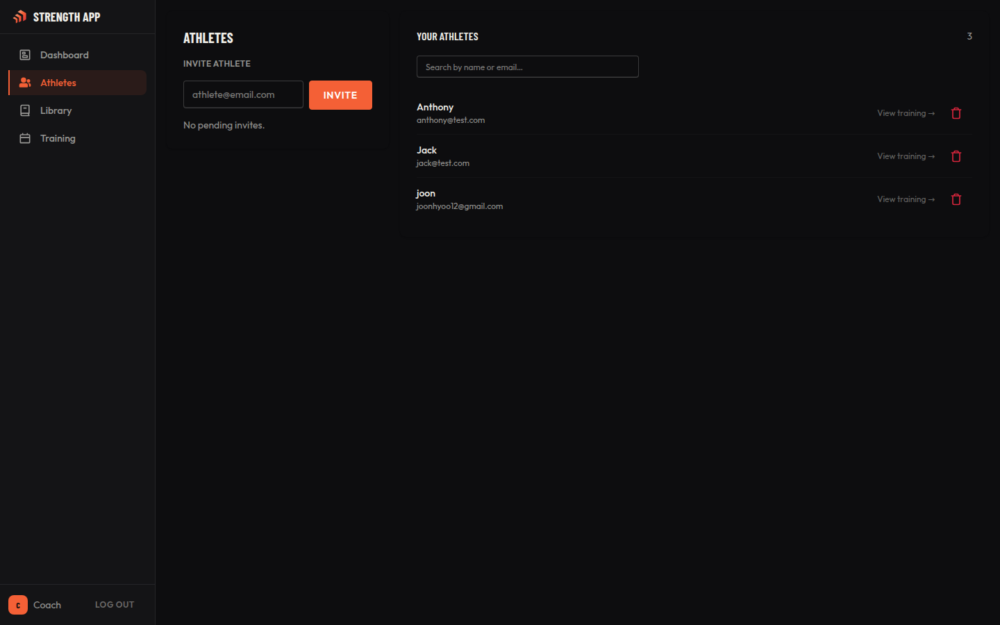
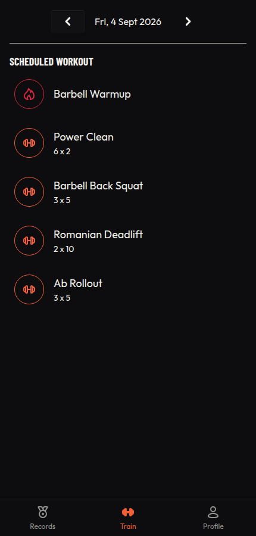

<p align="center">
  
</p>

<h1 align="center">Strength App</h1>

A coaching platform where coaches build and assign strength training programs, and athletes
train from them. Built with SvelteKit and Supabase.

## Features

**Coaches**

- Build a reusable exercise/program library (cycles → sessions → exercises)
- Schedule programs onto a training calendar and shift/assign them per athlete
- Invite athletes by email and manage their roster

**Athletes**

- View today's (or any day's) workout and log sets, reps, and weight while training
- Pull up an exercise's history to see past sessions right from the workout
- Calendar and personal-records views are in progress

## Screenshots

| Program library | Training timeline |
| :--- | :--- |
|  |  |

| Athlete roster | Athlete workout view |
| :--- | :--- |
|  |  |

## Tech Stack

| Technology | Use case                        |
| :--------- | :------------------------------- |
| SvelteKit  | Fullstack framework (Svelte 5)   |
| TypeScript | Type checking                    |
| Tailwind + DaisyUI | Styling                   |
| Supabase   | Auth + Postgres database         |
| Vercel     | Hosting (adapter-vercel)         |
| Vitest + Playwright | Testing                 |

## Getting Started

### Prerequisites

- Node 22+
- [Supabase CLI](https://supabase.com/docs/guides/cli) and Docker (for local Supabase)

### Setup

```sh
npm install
supabase start        # boots local Postgres/Auth/Storage
cp .env.example .env.local
```

Fill in `.env.local`:

- `PUBLIC_SUPABASE_URL` / `PUBLIC_SUPABASE_PUBLISHABLE_KEY` — from `supabase status`
- `SUPABASE_SECRET_KEY` — also from `supabase status` locally; see comments in
  `.env.example` for production (Vercel) setup

```sh
npm run dev            # start the dev server
npm run dev -- --open  # ...and open it in a browser
```

### Scripts

| Command | Description |
| :--- | :--- |
| `npm run dev` | Start the dev server |
| `npm run build` | Production build |
| `npm run preview` | Preview the production build |
| `npm run check` | Type-check (svelte-check) |
| `npm run lint` | Prettier + ESLint check |
| `npm run format` | Prettier write |
| `npm run test` | Run the test suite once |

## Project Structure

```
src/
  routes/
    (coach)/     coach dashboard, athlete roster, program library, training calendar
    (athlete)/   train view, calendar, records, profile
    auth/        login, signup, email confirmation
    api/         JSON endpoints backing client-side data fetching
  lib/
    components/  shared UI components
    services/    client-side data-fetching services (*.svelte.ts)
    server/      server-only code (admin Supabase client, program scheduling)
    data/        static reference data (categories, cycle colors)
supabase/
  migrations/    schema migrations
  templates/     auth email templates
```

## Deployment

Deployed to Vercel. Production Supabase config (auth providers, email templates, API keys)
is set in the Supabase dashboard, not in `supabase/config.toml` (which only applies locally).
